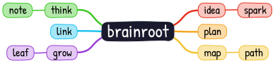
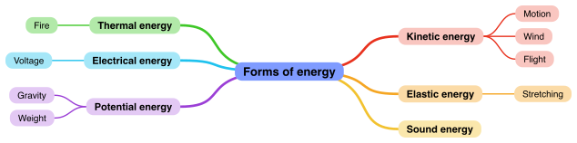
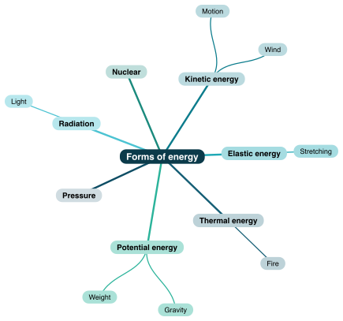
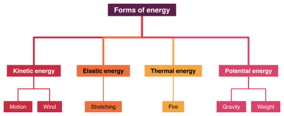
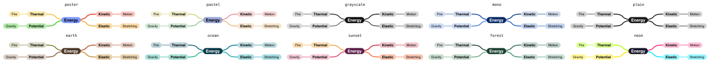
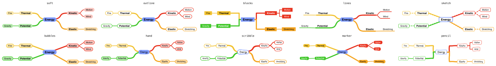
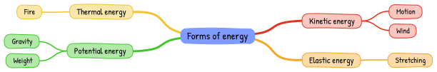
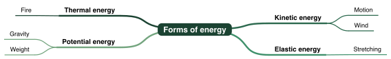

# brainroot

**Mind maps for Typst.** Write a nested list, get a map: the root in the
middle, every branch in its own colour down to its leaves, boxes sized to
their text, curves that meet where they should. Six layouts, ten themes,
ten palettes, and a hand-drawn mode in pure Typst.



## Usage

```typ
#import "@preview/brainroot:0.2.0": brainroot, branch

#brainroot(title: [Forms of energy])[
  - Kinetic energy
    - Motion
    - Wind
  - Elastic energy
    - Stretching
  - Thermal energy
    - Fire
  - Potential energy
    - Gravity
    - Weight
]
```

Every list item becomes a node, indented items become its children, to any
depth. To set the colour or side of a branch, write it as `branch(...)`:

```typ
#brainroot([Forms of energy],
  branch([Kinetic energy], [Motion], [Wind], color: red),
  branch([Elastic energy], [Stretching], side: left),
)
```

Both forms mix: a list and individual `branch` calls may stand side by side
as arguments.

## Parameters

`branch(label, ..kids, color: none, side: auto)`

- `color`: colour of the branch; `none` takes the next colour of the palette.
- `side`: `left` or `right` forces the side. Both only on the first level.
- `icon`, `icon-at`: an icon, emoji or image `"left"` of the label or on `"top"`.
- `fill`, `ink`: this node's fill (`none` gives a ring) and text colour.
- `mark: true`: bold text and a strong border, for key terms.
- `blank: true`: an empty box at full size, filled in with `solution: true`.
- `edge-label`: a small label on the edge into this node.
- `id`: a name for cross-links; `summary`: a labelled brace beyond the children; `cloud`: `true` or a colour behind the subtree.
- `points`: points for grading; `brainroot-points(...)` adds them up, `show-points: true` shows badges.

Labels are content: formulas (`[$E = m c^2$]`), images and `link()` work.

`brainroot(..branches, title: none, ...)`

- `title`: label of the root. Without it, the first positional argument is the root.
- `theme`: look of boxes and edges, see below. Default: `"soft"`.
- `layout`: arrangement, see below. Default: `"both"`.
- `start`: `radial` and `star` only, angle of the first branch. Default: `60deg`.
- `wobble`: strength of the wobble in hand-drawn themes, a factor on the theme's `amplitude`. Default: `1`.
- `palette`: name of a palette (see below), an array of colours, or `(colors: ..., root: ...)`. Default: `"poster"`.
- `root-fill`: colour of the root. Default: `auto`, the palette's.
- `tint`: how much the branch colour is lightened for the boxes. Default: `60%`.
- `tint-min`: minimum luminance (0 to 1) of tinted fills; dark colours are lightened further. Default: `0.8`.
- `ink`: text colour. Default: `auto`, then the fill's luminance decides between `ink-dark` (black) and `ink-light` (white); `ink-threshold` (0.55) is the boundary.
- `scale`: font size per level relative to the surroundings. Default: `(1.3, 1.1, 1.0)`.
- `bold-depth`: this many levels from the root are bold. Default: `2`.
- `thickness`: line width per level. Default: `(0.27em, 0.14em)`.
- `level-gap`, `root-gap`: distances along the direction of growth, parent to child and root to branch. Default: `3.5em`, `6em`.
- `sibling-gap`, `branch-gap`: distances across, between siblings and between first-level branches. Default: `0.7em`, `2em`.
- `max-width`: labels wider than this wrap. Default: `14em`.
- `inset`: padding of the boxes. Default: `(x: 0.9em, y: 0.55em)`.

- `icon`, `icon-at`: icon beside or above the root's label.
- `background`, `padding`: a colour behind the map and the space around it.
- `shade`: steps the branch colour per level, `20%` lighter towards the leaves, `-20%` darker. Default: `0%`.
- `blanks`: draws `"leaves"`, `"branches"` or `"all"` nodes as gaps; `solution: true` fills them in, `solution-ink` colours the answers.
- `edge-label-fill`: background of edge labels. Default: `white`.
- `links`: cross-links, each `connect(from, to, label: none, arrow: true, dash: "dashed", bend: 30%, color: auto)`, addressing nodes by `id` (`"root"` is the root).
- `brace-size`, `summary-gap`, `cloud-pad`: sizes of braces and clouds.
- `reveal`: `auto`, the number of first-level branches to draw, or a function of the index; the layout stays put.
- `align-levels: true`: every level on one line, as in an org chart.
- `alt`: alternative text for tagged PDFs; `auto` writes the tree out.
- `width`: `auto` for the natural size, or a length or ratio of the surrounding block to scale the whole map to, text included.
- `zoom`: a factor on the whole map, on top of `width`. Default: `100%`.

All lengths may be given in `em`; the defaults are, so a map follows the font size around it.

## Layouts

<p>


</p>

| `layout` | |
| --- | --- |
| `both` | root in the middle, branches right and left (default) |
| `right`, `left` | all branches on one side |
| `down`, `up` | tree from top to bottom or bottom to top |
| `fishbone` | Ishikawa: root as the head of a spine, branches as ribs, leaves along them |
| `radial` | the whole tree fans out from the root, every subtree in its own sector |
| `star` | branches on a circle around the root, subtrees grow horizontally outward |

With `both` and no `side` given, the first branches go right until the right
side reaches about half the total height; the rest go left. The top-to-bottom
order is kept on both sides. With `radial` and `star` the first branch
sits at `start`, the others follow clockwise; the rings grow until nothing
overlaps.

## Palettes



| `palette` | |
| --- | --- |
| `poster` | bright and bold, like markers on a whiteboard (default) |
| `pastel` | soft, muted tones |
| `grayscale` | greys only |
| `mono` | one blue in varying lightness |
| `plain` | one dark ink for everything |
| `earth` | terracotta, ochre, olive, sand |
| `ocean` | turquoise, teal, sea green |
| `sunset` | red, orange, pink, violet |
| `forest` | green with a little brown |
| `neon` | loud, saturated colours |

Your own colours: `palette: (red, blue, green)`, or with a root colour
`palette: (colors: (red, blue), root: black)`.

## Themes



A theme decides how boxes and edges look. The colours still come from the
palette.

| Theme | Boxes | Edges |
| --- | --- | --- |
| `soft` | pastel fill, rounded corners | soft S-curves |
| `outline` | white with coloured border | curves |
| `blocks` | solid colour, white text, square | right angles |
| `lines` | no box, text on a coloured line | curves flowing into the line |
| `sketch` | thin border, no fill | dashed straight lines |
| `bubbles` | pills, pastel fill | straight lines |
| `hand` | like `soft`, hand-drawn | wobbly curves |
| `scribble` | no fill, drawn twice | wobbly curves |
| `marker` | solid colour, felt-tip | wide wobbly straight lines |
| `pencil` | thin, pencil | shaky right angles |
| `organic` | pastel pills | branches that thin out towards the leaves |
| `twigs` | white circles, bare leaves | a spine with a twig to every leaf |

<p>


</p>

The four hand-drawn themes wobble every line after the TikZ decoration
`sketch`: along the path, with reproducible randomness. A handwriting font
such as "Patrick Hand" or "Kalam" suits them, either via
`set text(font: ...)` or the theme field `font`.

A dictionary overrides individual fields of a theme:

```typ
#brainroot(title: [Forms of energy],
  theme: (base: "outline", edge: "elbow", radius: 0pt), map)
```

Fields: `edge` (`"curve"`, `"elbow"`, `"straight"`, `"taper"`, `"comb"`), `fill` (`"tint"`,
`"solid"`, `"white"`, `"none"`), `stroke` (border width), `radius`,
`shape` (`"rect"`, `"circle"`, `"ellipse"`), `size` (a fixed diameter per
depth, e.g. `(5em, 4em, 2.6em)`, for bubble trees), `underline`, `dash`
(`"solid"`, `"dashed"`, `"dotted"`), `font`, `taper` (factors for
`edge: "taper"`), `root` and `branches` with overrides for the root and the
first level only, and `hand`: `none` or a dictionary with
`amplitude` (excursion in pt), `wavelength` (in pt), `randomness`
(irregularity, 1 is a pure sine), `segment` (step in pt) and `passes` (how
often each line is drawn).

```typ
#brainroot(title: [Forms of energy], layout: "radial",
  theme: (base: "blocks", hand: (amplitude: 1, wavelength: 60), font: "Kalam"),
  map)
```

## Manual

The manual is online in [English](https://loewe1000.github.io/brainroot/en.html)
and [German](https://loewe1000.github.io/brainroot/). Both build from `docs/`
with

```bash
typst compile docs/docs.typ docs/build --format bundle --features bundle,html --root /
```

and need `@schule/schuldocs` from [Typst-Schule](https://github.com/Loewe1000/Typst-Schule).

## Worksheets

A map with gaps and its solution from the same source:

```typ
#brainroot(title: [Forms of energy], blanks: "leaves", map)
#brainroot(title: [Forms of energy], blanks: "leaves", solution: true, solution-ink: red, map)
```

A probability tree with edge labels:

```typ
#brainroot(title: [Start], layout: "right", theme: "outline", palette: "plain",
  branch([Heads], branch([Heads], edge-label: $1/2$), branch([Tails], edge-label: $1/2$), edge-label: $1/2$),
  branch([Tails], branch([Heads], edge-label: $1/2$), branch([Tails], edge-label: $1/2$), edge-label: $1/2$))
```

Cross-links, a summary brace and a cloud:

```typ
#brainroot(title: [Photosynthesis],
  links: (connect("light", "dark", label: [ATP, NADPH]),),
  branch([Light reaction], [Photolysis], [ATP], [NADPH], id: "light", cloud: true),
  branch([Dark reaction], [Calvin cycle], [Glucose], id: "dark", summary: [products]),
)
```

Building up a map in a typstage deck, one branch per step:

```typ
#build(from => brainroot(title: [Forms of energy], reveal: i => from(i + 2), map), steps: 5)
```

A map of about 200 nodes compiles in well under a second, hand-drawn in
about two.

## Pictures and logo

Everything under `assets/` is drawn by brainroot itself; `assets/build.sh`
renders the SVGs. The logo comes in five variants: `logo-map` (the word as
root of a small map), `logo-hand` (the same, hand-drawn), `logo-lines`
(bare lines), `logo-roots` (the roots, top-down) and `logo-mark` (a square
mark without words, for icons).

## License

MIT. The hand-drawn themes follow the algorithm of the TikZ decoration
`sketch` from [this TeX.SE answer](https://tex.stackexchange.com/a/445690);
the implementation here is independent and written in Typst.
